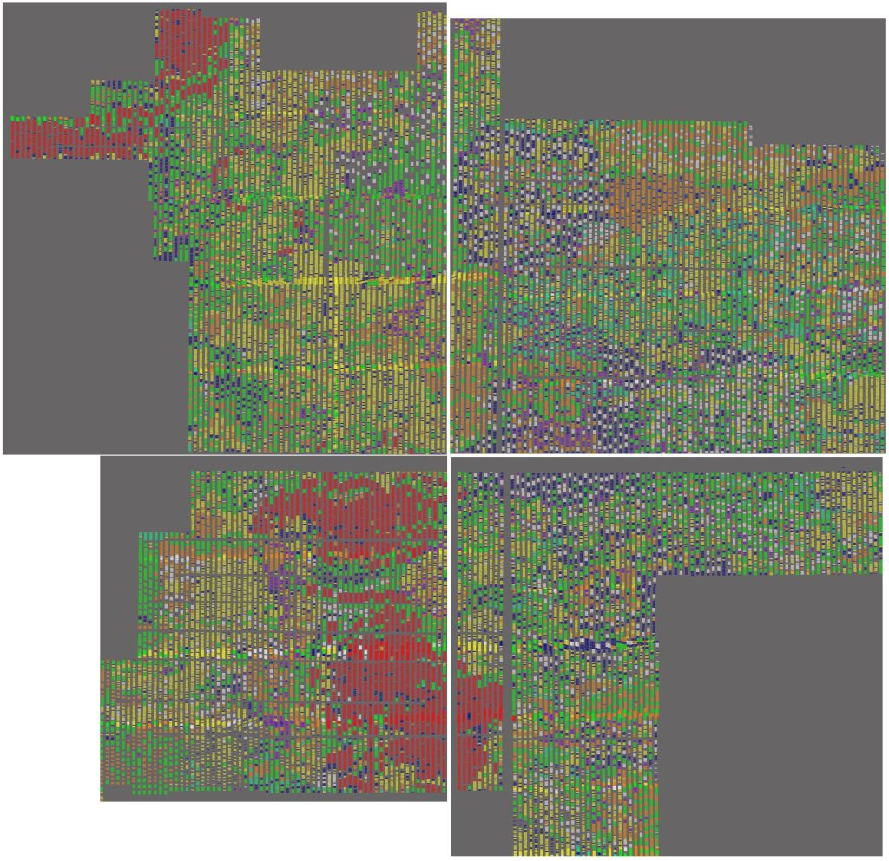

# PSX CPU Cells

This folder contains all research about psxcpu standard cells library.

Goals:
- Identify all cells
- Get sequenced cells map in xml/other convenient format

Cells in its glory:

## active_sequenced

Workspaces (\*.wrk) for patterns tool to identify cells over polysilicon images (images are supplied by request, they are too big).

See notes.txt about current progress and some info.

## cells_active

Cells polysilicon images (at least for some).

Very uncomplete.

## cells_circuits

Reversed standard cells transistor circuits via various ways (hand drawing, logisim etc.)

Somewhat uncompleted and messy.

## m1_cells

M1 layer images.

Somewhat uncomplete.

## Additional resources

- M1 cells interconnections stitched by rows: https://drive.google.com/file/d/1A6z6ZubVnuhC8zOan4aQl5zeZk-KMy15/view?usp=sharing
- Another uncompleted database: http://psxdev.ru/cells
- Some description (mostly Russian, use google translate): http://wiki.psxdev.ru/index.php/CPU_CELLS
- Patterns database (patterns_db) is most complete standard cells collection: https://github.com/ogamespec/psxdev/tree/master/tools/patterns/Build
