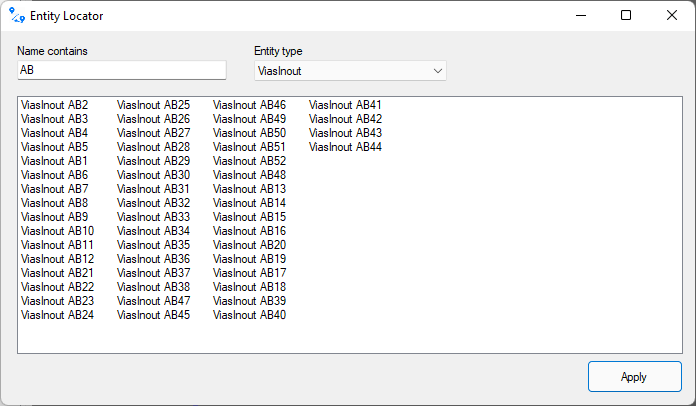
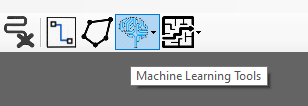
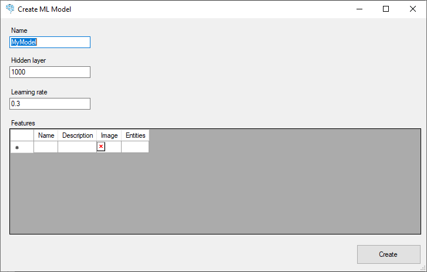
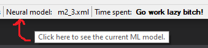
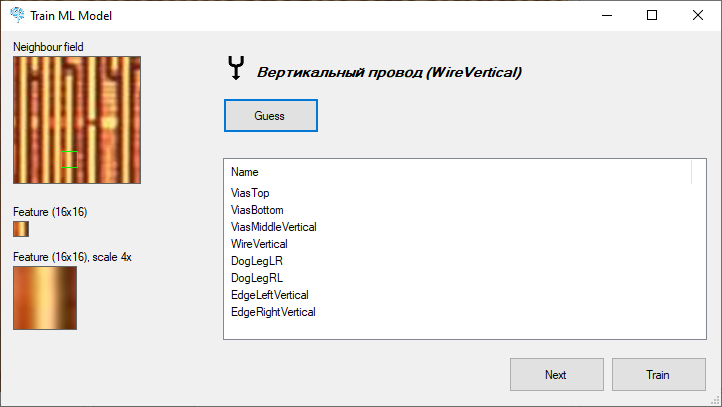
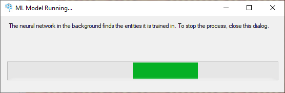
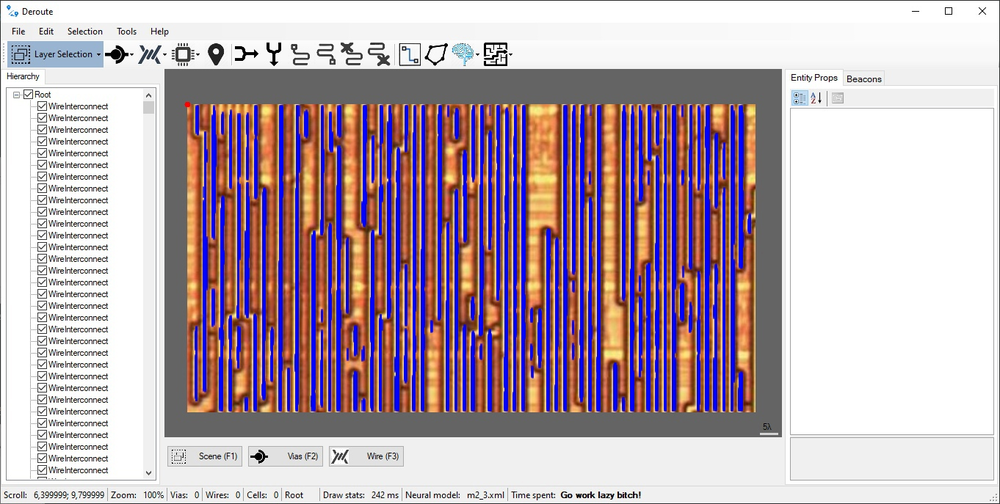

# Руководство по Deroute

## Обзор

Утилита Deroute предназначена для реверс инжиниринга микросхем и материнских плат.

XXX: Данная инструкция пока включает не все разделы. В принципе всё остальное самоописательное и можно просто потыкать кнопочки, чтобы разобраться.
Инструкция будет расширена со временем.

## Загрузка и сохранение данных

### Сохранить сущности как Netlist

Есть возможность выгрузить сущности в формате GraphML. Выгружается только базовая информация - вершины и ребра графа, чтобы формат GraphML был максимально совместимым и его можно было использовать в сторонних приложениях.

Особенности сохранения сущностей как Netlist:
- Все виасы (Vias) сохраняются как вершины графа. Если присутствует 2 или более виасов с одинаковым именем, то такие виасы считаются как одна вершина. Это сделано с целью "совмещения" сущностей с разных слоев микросхемы или PCB, там где они 
расходятся между фотографиями слоев;
- Провода (Wire) трактуются как ориентированные ребра графа. При этом несколько сегментов проводов объединяются в одно ребро графа. Правила совмещения сегментов аналогичны правилам траверса, используемых в Deroute. Имя ребра при этом получается
конкатенацией имен всех проводов, входящих в это ребро;
- Если часть виасов находятся "внутри" стандартной ячейки или юнита, то данная стандартная ячейка/юнит рассматривается как вершина графа, и соединения ребрами проводятся с этой ячейкой/юнитом, вместо набора виасов. При этом к старому имени провода добавляется
имя виаса, который теперь трактуется как вход/выход стандартной ячейки/юнита.

Для работы с GraphML рекомендуется программа yEd (https://www.yworks.com/products/yed). Она позволяет красиво уложить граф в схему.

Примеры сущностей выгруженных как Netlist:

## Локатор сущностей

Для быстрого получения списка требуемых сущностей можно воспользоваться локатором сущностей (Tools -> Entity Locator).

- Можно указать часть имени сущности (Label). Если поле ввода текста пустое, то имя сущности будет игнорироваться
- В списке можно выбрать типы требуемых сущностей. Кроме точного указания типа (напр. `ViasInout`) можно также указать "Все виасы", "Все провода", "Все ячейки" или "Все юниты".

При двойном клике сущность будет показана в главном окне.

## Машинное обучение

Нейросети применяются для распознавания элементов изучаемой микросхемы или PCB (виасы, провода, стандартные ячейки).

Весь функционал для работы с нейросетями производится через кнопку с мозгом.

### Создать ML модель

Данный диалог используется для создания ML модели (нейросети).

Модель включает в себя гиперпараметры нейросети (такие как `learningRate`), а также список фич, которые по сути являются выходами нейросети.

На вход нейросети подается небольшой кусочек основного изображения (16x16), а нейросеть на выходе выдает результат (производит классификацию).

На место найденной фичи ставится сущность, которая указана в столбце `Entities`.

Список свойств фичи:
- Name: имя фичи для отображения и обучения
- Description: просто описание для наглядности
- Image: просто картинка для наглядности. Можно выбрать любую иконку чисто в информативных целях. При нажатии открывается диалог выбора иконки
- Entites: сущности, которые необходимо добавить на место распознанной фичи. При нажатии на ячейку открывается MiniEntityBox, где нужно нарисовать сущности

Рекомендации по количеству фич:
- Нужно хотя бы 2 фичи, чтобы нейросеть могла делать корректную классификацию
- Фичи желательно выбирать максимально разными. Тут нужно воспользоваться своей интуицией - если человек однозначно отличает одну фичу от другой (например виас от провода), то этого
можно ожидать и от нейросети.

### Загрузить и сохранить ML модель

Самоописательные операции.

ML модель сохраняется в XML файл.

### Посмотреть текущую загруженную ML модель

Для того чтобы посмотреть текущую ML модель нужно нажать в строке состояние на пункт `Neural model`:

### Обучение модели

Самая веселая часть.

Для обучения модели необходимо предварительно загрузить исходное изображение (File -> Load Image).

Диалог обучения выглядит следующим образом:

- Neighbour field: участок исходного изображения откуда будет браться небольшой кусочек, 16x16 пикселей. Мышкой можно двигать зеленый квадратик.
- Feature: отображается кусочек которому нужно обучить нейросеть
- Guess: этой кнопкой можно проверить что думает нейросеть по выбранной фиче. Так можно проверять обученность нейросети. Над кнопкой Guess появится описание фичи (иконка, которую вы выбрали при создании модели (Image), описание (Description) и имя фичи (Name)).
Если нейросеть не знает что это за фича, она так и скажет.
- Список фич: в этом списке нужно выбрать фичу для обучения нейросети
- Next: пропустить обучение и выбрать следующую фичу. Это можно делать когда на изображении какой-то мусор или хочется обучить нейросеть на другом участке изображения
- Train: нейросеть обучается указанной из списка фичи

Рекомендации по обучению:
- Не следует задрачивать нейросеть одной фичей подряд. Такое обучение переобучит и разбалансирует нейросеть. Нужно стараться как можно чаще менять field и обучать нейросеть разным фичам.
- Практика показала, что натаскать сеть на простое распознавание (провода, виасы) достаточно обучить её примерно 100-200 раз.

### Запуск модели

Для запуска модели необходимо предварительно загрузить исходное изображение (File -> Load Image).

После запуска отображается modeless диалог с прогрессом сканирования:

Распознавание исходного изображения производится зигзагом, с шагом 1 пиксель.

Процесс распознавания можно в любой момент остановить, закрыв диалог `Run Model`.

В результате распознавания получается примерно следующее:

XXX: В настоящее время найденные сущности "наслаиваются" друг на друга, это будет исправлено в следующем релизе.

XXX: В настоящее время диалог не пишет процент готовности и не закрывается автоматически, это будет исправлено в следующем релизе.

Указанные недостатки не препятствуют обучению модели, поэтому ваша обученная модель может быть использована и потом, после устранения вышеуказанных недостатков.
