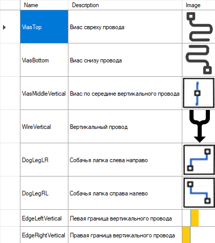

# Заметки по реализации машинного обучения в Deroute

В качестве движка (в основном для матриц) используется компонент NeuralNetwork. Этот компонент используется для менеджмента нейро-модели (загрузка/сохранение). Матрицы используют какой-то Parallel.For из шарпа, вроде как внутри там всё параллельно, я хз.

## Схема нейро-модели

Модель - банальный многослойный перцептрон (для начала).

Если дело пойдет, то компонент NeuralNetwork можно расширить для других диких моделей (нужно ещё набраться опыта).

Категория модели - Feature Recognition (распознавание фич).

Да, ещё забыл упомянуть, текущая нейромодель обладает собачьим зрением (не различает цвета).

## Фичи

Фича сейчас фиксированная 16x16. Ожидаемая фича хранится как картинка, которая задается пользователем. Список фич хранится вместе с моделью. 

Пример списка фич, которые нейромодель должна уметь распознавать:



Коллекция фич хранится просто как мета-информация, собственно нейросетке наплевать что-там хочет увидеть пользователь, ей главное гиперпараметры.

Количество фич равно количеству выходных нейронов, индексация начиная с 0. Для удобства вместо индекса используется строковое имя фичи, например `WireVertical`.

На картинке выше ещё не хватает столбца - какую сущность нужно будет запихнуть на место распознаной фичи. Тут надо подумать как сделать - идеально было бы рядом с фичей размещать EntityBox, где пользователь рисует требуемую сущность.

## Гиперпараметры

Настройки нейросети называются гиперпараметры (обычно это веса связей и параметры перцептронов, если они есть).

Также к гиперпараметрам относятся глобальные свойства нейросети, зависимые от выбранной модели (например `learningRate`).

Так как наша модель весьма дубовая, то и гиперпараметров там не так много, пример XML сериализованной модели:

```xml
<?xml version="1.0"?>
<State xmlns:xsi="http://www.w3.org/2001/XMLSchema-instance" xmlns:xsd="http://www.w3.org/2001/XMLSchema">
  <_learningRate>0.3</_learningRate>
  <_weightHiddenOutput>
    <ArrayOfDouble>
      <double>0.2559203323451496</double>
      <double>0.15096921979518813</double>
      <double>-0.066751145798529435</double>
      <double>-0.40557554478108537</double>
      <double>-0.46010667160751489</double>
      <double>-0.34636693428741239</double>

...
```

## Основные педали со стороны UI

Что касается работы с моделями (менеджмент):
- Нужно создавать новую модель, загружать и сохранять XML
- Для создания новой модели используется вспомогательный диалог, где пользователя просят указать модель и её параметры. Т.к. модель у нас пока одна и весьма ограниченная, то почти все поля будут ReadOnly. Также на диалоге будет редактор фич, чтобы при обучении
пользователю показывались веселые картинки.

Что касается непосредственно обучения и запуска:
- Для обучения используется вспомогательный диалог, который состоит из следующих частей: окошко с куском картинки из исходного изображения (используем ImageLayer0 из Deroute); кнопка "Пропустить", если на картинке какое-то говно; список с фичами,
при нажатии на фичу - нейросетка обучается указанной фиче; При закрытии тренировка прекращается.
- Для запуска распознавания используется Modeless диалог с Marque прогрессом и кнопкой "Остановить". На фоне работает Background Worker, который фидит нейросеть рандомными фичами из исходной картинки, а нейросеть угадывает что там. Угаданная сущность добавляется в текущего парента иерархии (`insertionNode` или рут, если он не выбран).

## Как выбрать между распознаванием проводов и виасов

Нужно натренить 2 разные нейросетки на разные фичи.

Из опыта - не хорошо в одну нейросеть загонять и сегменты проводов и виасы, с перцептронами получится ...забыл название... короче инвалидная нейросеть.
