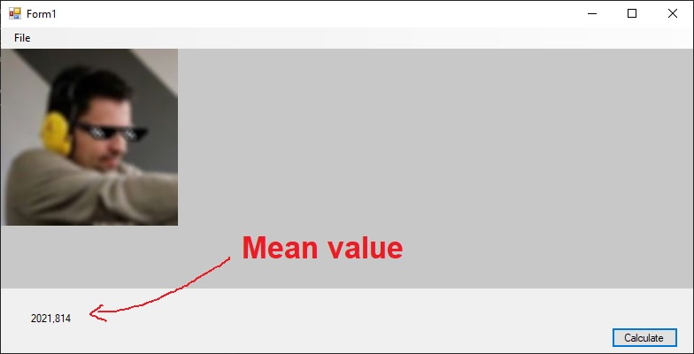
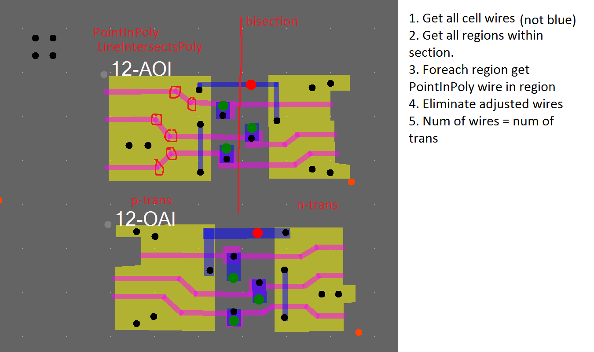
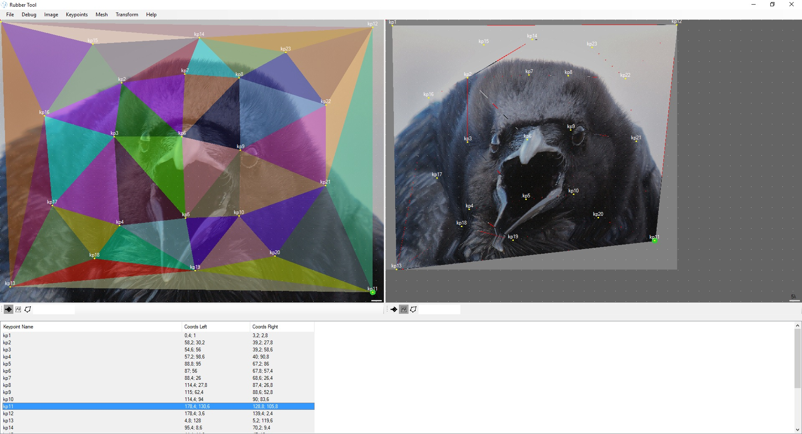

# Tools

Supplementary tools for chip reverse engineering.

## AutofocusDemo

Experimental tool to get best focused image from motorized microscope table.

## circuiter_qt

Hyper-graph oriented digital circuits simulator and editor.

## CollinearSolver

Construct complete wires from slighty collinear segments, generated by neural network.

## Deroute

Tool to get rid of wiring.

## Dromos

CanvasControl test tool.

## dumpobj

Dump PsyQ object files.

## EntityBox

Another canvas control, more oriented on chip reversing (wires, vias, etc.)

## ImageTiles

Split big image on smaller ones.

## libjpeg

Castrated libjpeg for patterns tool.

## logisim

Local copy of logisim in case of WW3.

## LogisimYed

Convert Logisim Circuits (.circ) to yEd Diagrams (.graphml)

## MachineLearningKit

Tool to train neural networks.

## NeuralDemo

Test neural core.

## NeuralNetwork

Basic neural core for MLK.

## patterns

Standard cells matching utility.

## PatternsDbGen

Tool to generate patterns_db.txt for patterns tool.

## RubberTool

Non-conform transformation to stitch non-aligned layers by their control points.

## WebEntityViewer

Experimental online viewer of Deroute xml files.

## yacr2

Source code of old channel router.
